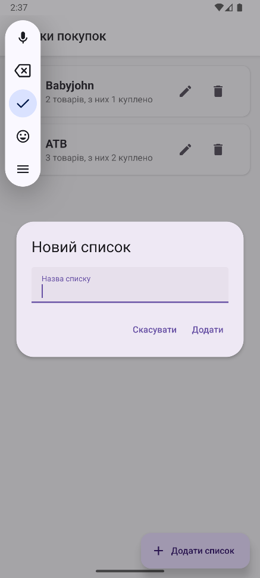

# ShoppingList

**ShoppingList** — мобільний застосунок для створення та управління списками покупок на React Native + Expo.

---

## Функціонал

- **Головний екран:**
  - Перелік усіх списків покупок
  - Кількість товарів у кожному списку та скільки куплено
  - Додавання, редагування, видалення списків
  - Перехід до деталей списку
  - Неможливо додати список з уже існуючою назвою

- **Деталі списку:**
  - Перелік товарів у вибраному списку
  - Додавання, редагування, видалення товарів
  - Відмітка "куплено/не куплено" для кожного товару
  - Неможливо додати товар з уже існуючою назвою у цьому списку
  - Підрахунок загальної кількості та куплених товарів

- **Додатково:**
  - Підтвердження перед видаленням списку чи товару
  - Україномовний інтерфейс
  - Мінімалістичний сучасний дизайн (react-native-paper)
  - Локальне збереження даних (AsyncStorage)

---

## Встановлення та запуск

1. **Клонувати репозиторій:**
   ```bash
   git clone https://github.com/Dmytro-Butnyk/ShoppingList.git
   cd ShoppingList
   ```

2. **Встановити залежності:**
   ```bash
   npm install
   ```

3. **Запустити у Expo:**
   ```bash
   npx expo start
   ```
   Відскануйте QR-код у Expo Go (Android/iOS) або запустіть на емуляторі.

---

## Скриншоти (демонстрація)

<div align="center">

<table>
  <tr>
    <td></td>
    <td></td>
  </tr>
  <tr>
    <td></td>
    <td></td>
  </tr>
</table>

</div>

---

## Структура проєкту

```
exam/
├── App.js
├── /components
│   ├── ListItem.js
│   ├── ProductItem.js
│   └── AddProductModal.js
├── /screens
│   ├── ListsScreen.js
│   └── ListDetailScreen.js
├── /context
│   └── ShoppingListContext.js
├── /storage
│   └── storage.js
├── /assets
│   └── icons, images
└── app.json
```

---

## Технічні деталі
- React Native + Expo (blank)
- React Navigation (Stack Navigator)
- react-native-paper (UI)
- @react-native-async-storage/async-storage (локальне збереження)

---